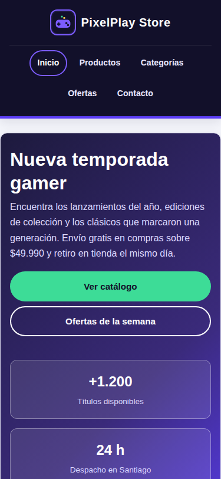
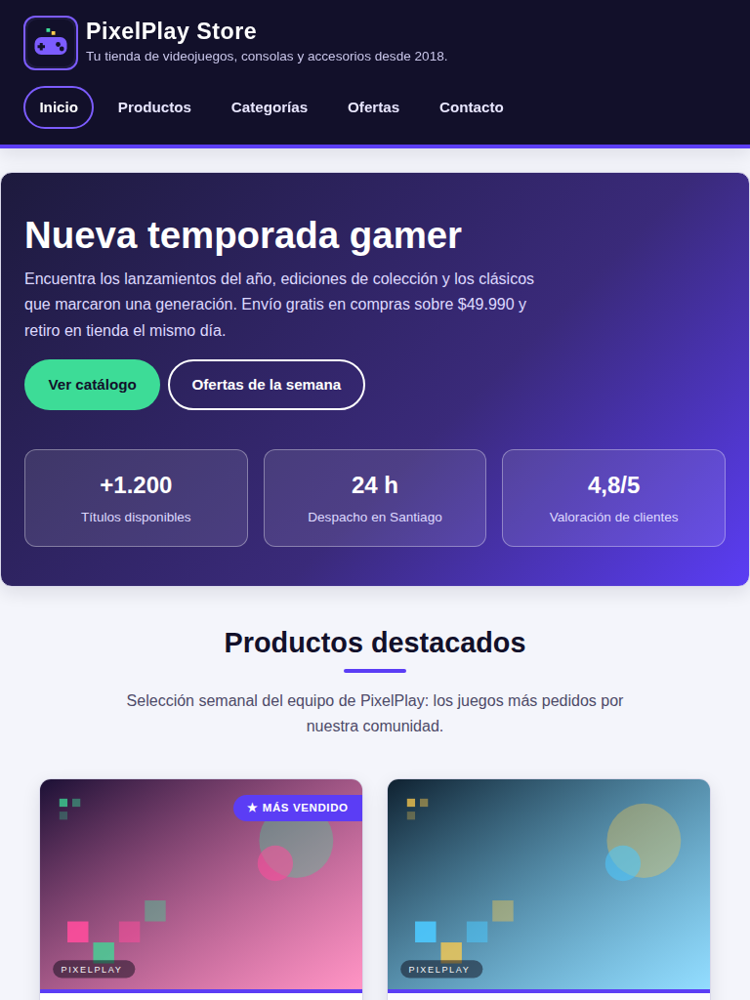
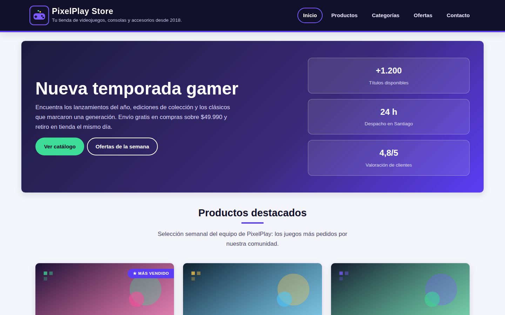

# PixelPlay Store — Tienda de Videojuegos

Actividad **Sumativa Semana 3** — *Optimizando un Sitio Web con HTML, CSS y Diseño Responsivo*
Asignatura: **Desarrollo Frontend I (PFY2201)** · Duoc UC
Autor: **Ignacio**

Sitio web de una tienda de videojuegos construido con HTML5 semántico y CSS3, optimizado
con el modelo de cajas, un esquema propio de colores y tipografías, y diseño responsivo
con **Flexbox**, **CSS Grid** y **media queries**.

---

## 🔗 Enlaces

| Recurso | URL |
|---|---|
| Repositorio | https://github.com/Ign14/DF1_ExpSumativas |
| Sitio publicado (GitHub Pages) | https://ign14.github.io/DF1_ExpSumativas/ |

---

## 📁 Estructura del proyecto

```
DF1_ExpSumativas/
├── index.html                  # Estructura HTML5 semántica del sitio
├── css/
│   └── styles.css              # Hoja de estilos externa (única)
├── img/
│   ├── logo.svg                # Logotipo de la tienda
│   └── juego-1..6.svg          # Portadas de los productos
├── docs/
│   └── capturas/               # Capturas móvil, tablet y escritorio
├── entrega/                    # Copias con el nombre exigido por el AVA
├── .gitignore
└── README.md
```

---

## ✅ Requisitos de la actividad y dónde se cumplen

| Criterio de la pauta | Implementación | Dónde verlo |
|---|---|---|
| 1. Estructura HTML con etiquetas semánticas (20 pts) | `header`, `nav`, `main`, `section`, `article`, `aside`, `footer`, jerarquía `h1`→`h3`, listas `ul`/`ol`, enlaces, imágenes con `alt` | `index.html` |
| 2. Estilos CSS con vinculación correcta (15 pts) | Hoja **externa** enlazada con `<link rel="stylesheet" href="css/styles.css">`; sin estilos en línea | `index.html` línea del `<head>` · `css/styles.css` |
| 3. Modelo de cajas (15 pts) | `box-sizing: border-box` global, `margin`, `padding`, `border`, `border-radius` y escala de espaciado con variables CSS | `css/styles.css` §01 y §05 |
| 4. Colores y tipografía (10 pts) | Paleta definida en `:root` (fondo, texto, bordes, acentos), dos familias tipográficas y escala de tamaños; contraste AA | `css/styles.css` §01 y §02 |
| 5. Diseño responsivo (15 pts) | **Flexbox** en encabezado, navegación, etiquetas y pie de página; **CSS Grid** en hero, catálogo, categorías, ofertas y contacto; **media queries** en 600 px, 992 px y 1400 px (enfoque *mobile first*) | `css/styles.css` §03–§10 |
| 6. Verificación en navegadores (15 pts) | Probado en los tres motores de render: Blink (Chrome/Edge/Opera), Gecko (Firefox) y WebKit (Safari), en anchos de 320 a 1920 px; sin prefijos propietarios ni propiedades experimentales | `docs/capturas/navegadores/` |
| 7. Publicación en GitHub con capturas (10 pts) | Repositorio con HTML, CSS, imágenes y capturas; despliegue en rama `gh-pages` | Este README y `docs/capturas/` |

---

## 🎨 Decisiones de diseño

**Modelo de cajas.** Se aplica `box-sizing: border-box` a todos los elementos para que el
`padding` y el `border` queden incluidos en el ancho declarado. El espaciado usa una escala
de cuatro pasos (`--espacio-xs` a `--espacio-lg`) para mantener ritmo vertical consistente.

**Colores.** Paleta oscura de marca (`#12102a`) con violeta primario (`#5b3df5`) y verde de
acento (`#12805c` / `#3ddc97`) sobre superficies claras. Todas las combinaciones de texto
alcanzan un contraste mínimo de 4.5:1 (WCAG AA).

**Tipografía.** *Trebuchet MS* para títulos y *Segoe UI* para texto corrido, ambas con pila
de respaldo (`sans-serif`), de modo que el sitio no depende de fuentes externas.

**Selectores avanzados utilizados.**

- `.grid-productos .producto:nth-child(even)` — alterna el fondo de las tarjetas pares.
- `.producto__meta li:first-child` — resalta la plataforma de cada juego.
- `.categoria:nth-child(2)` / `:nth-child(3)` — color de acento distinto por categoría.
- `:hover` y `:focus-visible` en enlaces, botones y tarjetas.
- `.section-title::after` — subrayado decorativo generado por CSS.
- `.producto:first-child > article::after` / `:last-child > article::after` — cintas
  “★ Más vendido” y “Novedad” superpuestas a la portada.

**Objetivos táctiles.** Enlaces de listas, navegación, redes, botones y campos del formulario
tienen `min-height: 44px`, cumpliendo el criterio WCAG 2.5.8 con holgura.

---

## 🧪 Pruebas realizadas

| Prueba | Resultado |
|---|---|
| Validación HTML5 | Sin errores de estructura |
| Sintaxis CSS | 284 reglas, sin errores |
| Contraste de color (WCAG AA) | 12 combinaciones medidas, todas ≥ 4,5:1 |
| Desbordamiento horizontal | 320, 375, 414, 600, 768, 992, 1280, 1440 y 1920 px — sin scroll lateral |
| Motores de render | Blink (Chrome/Edge), Gecko (Firefox) y WebKit (Safari) — mismo layout, sin errores de consola |
| Objetivos táctiles | Navegación, listas, redes, botones y campos con 44 px de alto mínimo |

---

## 📱 Puntos de quiebre (media queries)

| Dispositivo | Ancho | Comportamiento |
|---|---|---|
| Móvil | `< 600 px` | Una columna, encabezado compacto no fijo, navegación centrada, estadísticas apiladas |
| Tablet | `≥ 600 px` | Catálogo y categorías a 2 columnas, estadísticas en fila de 3 |
| Escritorio | `≥ 992 px` | Catálogo y categorías a 3 columnas, hero a 2 columnas, encabezado en una sola línea |
| Escritorio amplio | `≥ 1400 px` | Contenedor de 1320 px y titulares mayores |

También se incluyen `@media (prefers-reduced-motion: reduce)` para accesibilidad y una hoja
de impresión que oculta la navegación y los botones.

---

## 🖼️ Capturas de pantalla

| Móvil (375×812) | Tablet (768×1024) | Escritorio (1440×900) |
|---|---|---|
|  |  |  |

Las versiones de página completa están en `docs/capturas/` (la de móvil, por su altura,
va dividida en `-parte1` y `-parte2`). En `docs/capturas/navegadores/` está la comparación
entre motores de render.

---

## ♿ Accesibilidad y buenas prácticas

- `lang="es"`, `charset="UTF-8"` y `meta viewport` declarados.
- Enlace “Saltar al contenido principal” para navegación por teclado.
- Todas las imágenes con texto alternativo descriptivo.
- `aria-label` en `nav` y `aria-labelledby` en cada sección.
- Etiquetas `<label>` asociadas a cada campo del formulario mediante `for`/`id`.
- Foco visible (`:focus-visible`) en enlaces, botones y campos.
- Jerarquía de encabezados sin saltos de nivel.

---

## 🚀 Cómo ejecutar el proyecto localmente

```bash
git clone https://github.com/Ign14/DF1_ExpSumativas.git
cd DF1_ExpSumativas
# Abre index.html en el navegador, o levanta un servidor local:
python -m http.server 8000
# luego visita http://localhost:8000
```


---

*Reservados los derechos del material del curso a Fundación Instituto Profesional Duoc UC.*
